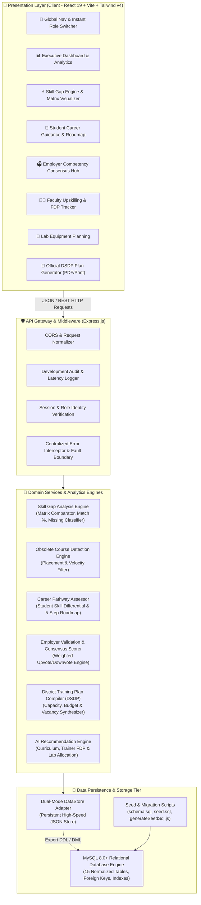
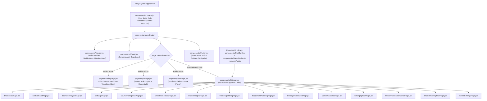
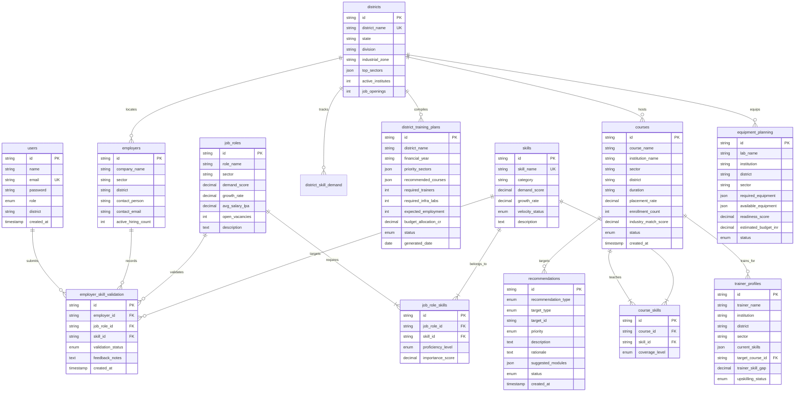
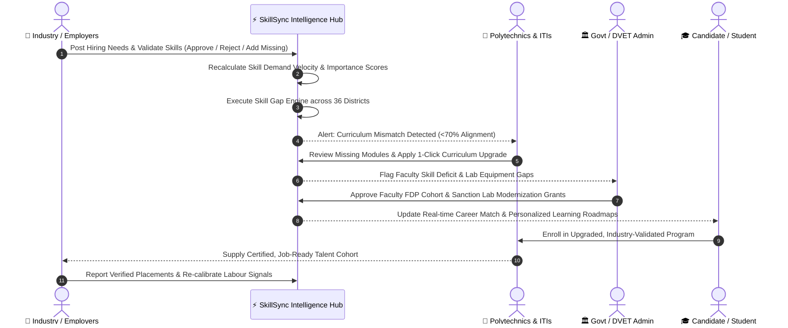
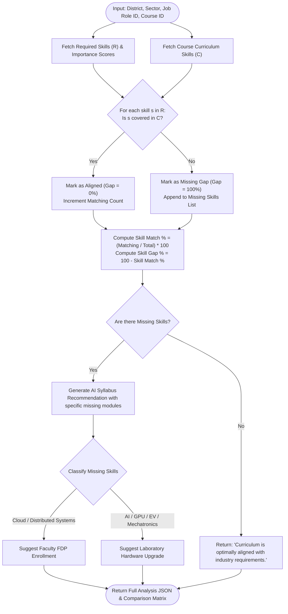
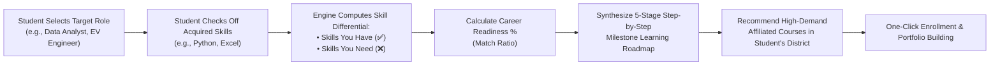
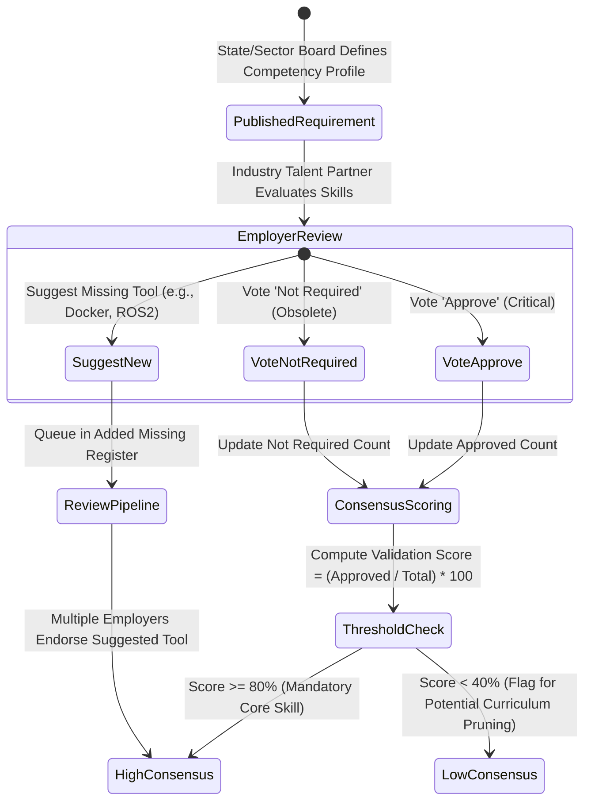
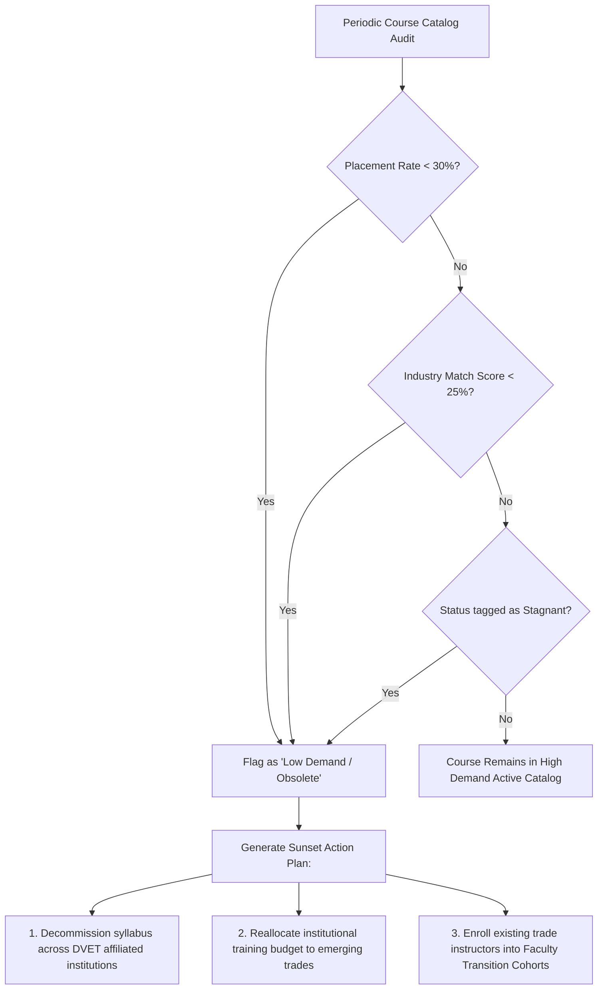
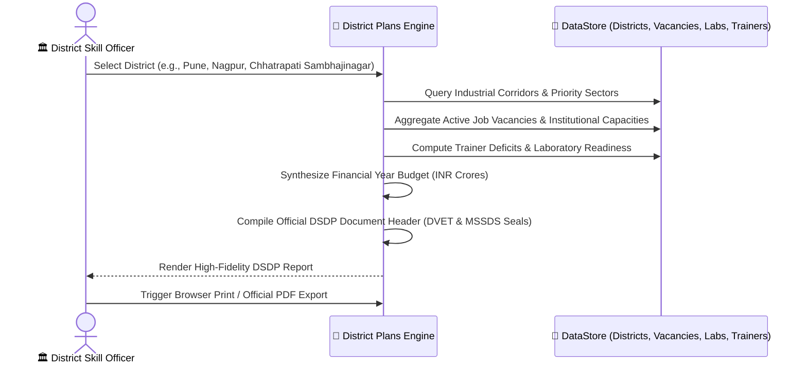

# 🌟 SkillSync Maharashtra
### *Labour Market Intelligence & Curriculum Alignment Platform*
#### **Government of Maharashtra — Department of Skill Development, Employment and Entrepreneurship (DVET & MSSDS)**

> **Motto:** *"Right Skills. Right Training. Right Jobs."*  
> **Mission:** Eliminating the structural disconnect between technical curricula and industrial demand across Maharashtra's 36 districts through continuous, closed-loop labour market intelligence.

---

[](https://vitejs.dev/)
[](https://react.dev/)
[](https://groq.com/)
[](https://nodejs.org/)
[](https://expressjs.com/)
[](https://tailwindcss.com/)
[](https://www.netlify.com/)
[](LICENSE)

---

## 📑 Table of Contents

1. [Executive Summary](#-executive-summary)
2. [2026 Flagship Innovations & Recent Upgrades](#-2026-flagship-innovations--recent-upgrades)
   - [Groq Cloud AI Integration (Flagship 120B Model & GFM Assistant)](#1-groq-cloud-ai-engine--interactive-assistant)
   - [Executive Professional PDF Dossier Export Engine](#2-executive-professional-pdf-dossier-export-engine)
   - [Student Skill Demand & Placement Intelligence Hub](#3-student-skill-demand--placement-intelligence-hub)
   - [Netlify Cloud Deployment & SPA Configuration](#4-netlify-cloud-deployment--spa-configuration)
3. [The Maharashtra Context & Problem Statement](#-the-maharashtra-context--problem-statement)
4. [System Architecture](#-system-architecture)
   - [High-Level Architectural Diagram](#1-high-level-multi-tier-architecture)
   - [Frontend Component Hierarchy](#2-frontend-component-architecture)
   - [Relational Database Schema (ERD)](#3-relational-database-schema--erd)
5. [Core End-to-End System Flows](#-core-end-to-end-system-flows)
   - [Closed-Loop Labour Market Intelligence Flow](#1-closed-loop-labour-market-intelligence-flow)
   - [Skill Gap Analysis Engine & Mathematical Model](#2-skill-gap-analysis-engine--mathematical-model)
   - [Student Career Guidance & Roadmap Flow](#3-student-career-guidance--roadmap-flow)
   - [Employer Consensus Validation Flow](#4-employer-consensus-validation-flow)
   - [Obsolete Course Detection & Sunset Engine Flow](#5-obsolete-course-detection--sunset-engine-flow)
   - [District Skill Development Plan (DSDP) Pipeline](#6-district-skill-development-plan-dsdp-pipeline)
6. [Exhaustive 18-Module Functional Breakdown](#-exhaustive-18-module-functional-breakdown)
7. [Multi-Stakeholder Personas & Instant Demo Switcher](#-multi-stakeholder-personas--instant-demo-switcher)
8. [Complete REST API Specification](#-complete-rest-api-specification)
9. [Data Architecture & Dual-Mode Database Engine](#-data-architecture--dual-mode-database-engine)
10. [Installation & Local Setup Guide](#-installation--local-setup-guide)
11. [Repository Directory Structure](#-repository-directory-structure)
12. [Verification, Testing & Performance Benchmarks](#-verification-testing--performance-benchmarks)
13. [Future Roadmap & State Rollout Strategy](#-future-roadmap--state-rollout-strategy)

---

## 🚀 2026 Flagship Innovations & Recent Upgrades

### 1. Groq Cloud AI Engine & Interactive Assistant
SkillSync Maharashtra features state-of-the-art Generative AI capabilities powered by **Groq Cloud's ultra-low-latency LPU infrastructure**:
- **Flagship 120B Open-Weights Model (`openai/gpt-oss-120b`)**: Provides superior analytical reasoning for deep curricular gap diagnosis and step-by-step career path counseling in under 700ms.
- **Dual-Tier Resilient AI Pipeline**:
  - *Tier 1:* Server-side Groq service (`/api/ai/chat`, `/api/ai/skill-recommendations`) with automatic model failover and JSON schema enforcement.
  - *Tier 2:* Direct client-side HTTPS fallback to Groq Cloud for static/Netlify deployments, supporting inline API key input and encrypted local storage.
- **Ultra-Premium Floating AI Copilot (`GroqAiAssistant.jsx`)**:
  - GitHub Flavored Markdown (GFM) rich rendering with styled comparison tables (dark gradient headers, alternating zebra stripes, horizontal scroll).
  - Widescreen expand mode for detailed multi-column syllabus inspection.
  - 1-Click snippet copy with dynamic checkmark feedback.
  - Glowing luminous floating launcher with responsive mobile optimization.

### 2. Executive Professional PDF Dossier Export Engine
Re-engineered the client-side document export subsystem into an **Official Government of Maharashtra Curriculum Dossier**:
- **Engine Upgrade**: Switched from legacy window printing to `html2canvas-pro` + `jspdf`, cleanly bypassing Tailwind CSS v4 `oklch()` color parsing issues without canvas rendering exceptions.
- **Official Directorate Layout**:
  - Deep navy (`#0b2545`) and gold executive header with Government of Maharashtra and DVET / MSSDS emblems.
  - Security tracking metadata: Unique Document ID (`MAH-SS-CR-...`), Issue Date, Candidate Tracking Code, and `SHA256-VERIFIED` seal.
- **Deep Pedagogical Explanations**:
  - Replaced raw, cramped tables with step-by-step stage cards.
  - Detailed pedagogical objectives explaining industrial relevance for Pune, Mumbai, and regional MIDC belts.
  - Hands-on practical lab projects, applied tooling badges (`Python 3.12`, `PyTorch 2.4`, `Docker`, `CAN-Bus`), and measurable career competencies.
  - Full 5-unit curriculum deep dive for all affiliated ITI/Polytechnic programs.
  - 100% direct `.pdf` file download without intrusive browser print dialogs.

### 3. Student Skill Demand & Placement Intelligence Hub
The student dashboard (`DashboardPage.jsx`) features an interactive, high-contrast **Placement Intelligence Hub**:
- **Multi-Dimensional Controls**:
  - Live search filter across technical competencies and hiring employers.
  - Regional corridor selector: `Pune (Tech & Auto)`, `Mumbai (FinTech & IT)`, `Nagpur (Logistics)`, `Nashik`, `Aurangabad`.
  - Domain pills with live count badges: `AI & Software`, `EV & Automotive`, `Cloud & DevOps`, `Industrial Automation`, `Data & Analytics`, `Smart Logistics`.
- **Triple View Switcher**:
  - **📋 Directory Cards View**: Rank badges (Gold Crown `#1`, Silver `#2`, Bronze `#3`), animated demand progress meter, 3-metric statistics grid (Vacancies, Salary LPA, Corridor), top hiring corporates, key syllabus focus, and direct `🚀 Plan Learning Roadmap` button linking to `/career-guidance`.
  - **📊 Demand & Jobs Chart**: Recharts bar visualization comparing demand urgency against verified vacancies.
  - **💰 Salary LPA Benchmarks**: Recharts bar chart contrasting Junior Entry CTC vs 3-Year Experienced CTC.
- **Student Placement Accelerator Banner**: Direct action prompts linking market demand to the AI Career Wizard and job matching portal.

### 4. Netlify Cloud Deployment & SPA Configuration
- **Continuous Deployment Setup**: Included `netlify.toml` configuring Node.js 18+ runtime, `npm run build` command, and `dist` publish target.
- **SPA 200 Rewrite**: Configured `frontend/public/_redirects` (`/*  /index.html  200`) ensuring seamless client-side routing on Netlify with zero 404s on deep links.

---

## Module 5 — Dynamic Skill Gap Analysis

The Skill Gap page now compares persisted industry role requirements against persisted course curricula. Course records are seeded from the existing `backend/data/courses.json` dataset into `courses` and `course_skills`; role requirements come from `job_roles` and `role_skills`, and both sides resolve through the normalized `skills` table.

The engine returns required, covered, missing, and high-priority missing skills, plus a matrix explaining that each gap is required by the selected industry role but absent from the selected curriculum. Coverage is calculated as covered role-skill weight divided by total role-skill weight. `required` and `preferred` importance values use weights `1.0` and `0.75`; `mentioned` falls back to `1.0` because no stronger signal is available. Gap percentage is `100 - coverage`.

### Module 5 API

- `GET /api/courses`
- `GET /api/courses/{course_id}`
- `GET /api/skill-gap/role/{role_id}?course_id={course_id}`
- `GET /api/skill-gap/course/{course_id}?role_id={role_id}`
- `GET /api/skill-gap/analyze?role_id={role_id}&course_id={course_id}`
- `POST /api/skill-gap/analyze` with `{ "role_id": 1, "course_id": "course-data-analytics" }`

Run the backend migration from `backend` with `python -m alembic upgrade head`; then start FastAPI on port `8000` and the Vite frontend on port `5173`.

## Module 6 — AI-Powered Recommendation Engine

The Skill Gap experience now sends its live role/course analysis to `POST /api/ai/skill-recommendations`. The server reuses the existing Groq/LLaMA integration; no API key is exposed to the browser. When `GROQ_API_KEY` is configured, the request asks for strict JSON output containing one recommendation for every actual missing skill, its priority, reason, learning order, and learning direction. Responses are validated against the missing-skill set before they can reach the frontend.

When the AI provider is unavailable, times out, has quota/authentication problems, or returns malformed JSON, the server returns a deterministic `local:data-gap` fallback. That fallback ranks the real missing skills using their role importance weights, explains that each skill is absent from the selected curriculum, derives a learning direction from the normalized skill category, and includes matching courses/roles where the supplied data supports them. A no-gap analysis returns an empty recommendation list rather than invented advice.

Run the recommendation tests with `cd backend` followed by `npm run test:ai`. The full Python regression suite remains available through `python -m pytest -q`, and the frontend is verified with `cd frontend` followed by `npm run build`.

---

## 🏛 Executive Summary

**SkillSync Maharashtra** is a comprehensive, production-grade Labour Market Intelligence and Dynamic Curriculum Alignment Platform designed for the **Directorate of Vocational Education and Training (DVET)** and the **Maharashtra State Skill Development Society (MSSDS)**.

Traditional technical education creates a persistent paradox: **employers across industrial corridors face severe talent shortages in modern trades (Cloud, EV diagnostics, Industrial Robotics, Generative AI), while thousands of ITI and Polytechnic graduates remain underemployed because syllabi lag 5–10 years behind industry practice.**

SkillSync Maharashtra bridges this divide by providing a unified, data-driven platform that connects:

$$\text{Live Employer Signals} \longrightarrow \text{Competency Profiling} \longrightarrow \text{Real-time Gap Computation} \longrightarrow \text{Curriculum Interventions} \longrightarrow \text{Trainer Upskilling (FDP)} \longrightarrow \text{Lab Equipment Upgrades} \longrightarrow \text{Student Career Roadmaps} \longrightarrow \text{Employment}$$

```
                           THE SKILLSYNC CLOSED LOOP
                        
                 ┌──────────────────────────────────────┐
                 │    Industry Demand & Live Vacancies   │
                 └──────────────────┬───────────────────┘
                                    │ (Real-Time Signals)
                                    ▼
                 ┌──────────────────────────────────────┐
                 │   Competency Profiling & Validation  │
                 └──────────────────┬───────────────────┘
                                    │ (Employer Consensus)
                                    ▼
                 ┌──────────────────────────────────────┐
                 │    Skill Gap Analysis Engine         │
                 └──────────────────┬───────────────────┘
                                    │ (Calculates Match % & Gaps)
                                    ▼
       ┌────────────────────────────┴────────────────────────────┐
       ▼                                                         ▼
┌──────────────────────────────┐              ┌──────────────────────────────┐
│  AI Curriculum Interventions  │              │  Infrastructure Modernization │
│  - Syllabus Revision         │              │  - Faculty FDP Enrollment    │
│  - Obsolete Course Sunset    │              │  - Lab Equipment Grants      │
└──────────────┬───────────────┘              └──────────────┬───────────────┘
               │                                             │
               └──────────────────────┬──────────────────────┘
                                      ▼
                 ┌──────────────────────────────────────┐
                 │      Job-Ready Certified Talent      │
                 └──────────────────┬───────────────────┘
                                    │
                                    ▼
                 ┌──────────────────────────────────────┐
                 │   Direct Employment & Feedback Loop  │
                 └──────────────────────────────────────┘
```

---

## 📍 The Maharashtra Context & Problem Statement

Maharashtra is India’s industrial powerhouse, contributing over 14% to national GDP. However, its industrial ecosystem is characterized by sharp regional specializations and fast-evolving technological demands:

* **Pune Industrial Belt:** Chakan, Bhosari, Talegaon, and Hinjawadi require high concentrations of Automotive EV Engineers, Mechatronics experts, Cloud Architects, and Industrial Robotics specialists.
* **Mumbai Metropolitan Region (MMR):** Skyrocketing demand for FinTech Analysts, Full Stack Engineers, Cybersecurity specialists, and AI/Data Science practitioners.
* **Nagpur & Vidarbha:** Rapidly expanding Multimodal International Cargo Hub and Airport at Nagpur (MIHAN), driving demand for Logistics Automation, Warehouse Robotics, and Solar Energy Technicians.
* **Nashik, Chhatrapati Sambhajinagar, Kolhapur & Solapur:** Heavy engineering, electrical equipment, machine tooling, agro-processing, and textile modernization requiring CNC programming, PLC scada, and IoT automation.

### The Problem:
1. **Curricular Inertia:** State ITI and Polytechnic syllabi are updated once every 5 to 7 years. Obsolete subjects (e.g., legacy COBOL, classic drafting, manual carburetor tuning) continue to consume educational budgets.
2. **Faculty Skill Stagnation:** Technical instructors lack hands-on exposure to Industry 4.0 paradigms (ROS2, PyTorch, Battery Management Systems, AWS/Azure).
3. **Sub-optimal Infrastructure:** Labs frequently lack modern apparatus (GPU clusters, hardware-in-the-loop EV simulators, collaborative robots).
4. **Student Career Blindspots:** Students complete degree and diploma programs without insight into which specific technical competencies are in demand in their home districts.

---

## 🏗 System Architecture

### 1. High-Level Multi-Tier Architecture

The platform is designed around a clean separation of concerns, featuring a modern Single-Page Application (SPA) client, a high-throughput RESTful API layer, specialized mathematical computation engines, and a dual-mode persistent data tier.



---

### 2. Frontend Component Architecture



---

### 3. Relational Database Schema & ERD

The backend architecture is backed by an enterprise MySQL 8.0+ relational schema (`backend/database/schema.sql`) consisting of 15 interconnected relational tables:



---

## 🔄 Core End-to-End System Flows

### 1. Closed-Loop Labour Market Intelligence Flow

The fundamental problem with educational planning is latency. SkillSync Maharashtra provides a continuous loop where changes in employer hiring instantly trickle down into course syllabus recommendations and lab infrastructure funding.



---

### 2. Skill Gap Analysis Engine & Mathematical Model

The Skill Gap Analysis Engine (`backend/routes/skillGapRoutes.js`) is the primary computational core. Given a target **District**, **Sector**, **Job Role**, and **Course**, it parses the competency vectors and computes the alignment metrics.

#### Mathematical Formulation:

Let $R = \{s_1, s_2, \dots, s_N\}$ be the ordered set of industry-required skills for job role $J$.  
Let $C = \{c_1, c_2, \dots, c_M\}$ be the normalized set of competencies covered in the course syllabus.

1. **Alignment Indicator Function:**
   $$\mathbb{I}(s_i, C) = \begin{cases} 1 & \text{if } \exists c_j \in C \text{ such that } \text{Sim}(s_i, c_j) \ge \tau \\ 0 & \text{otherwise} \end{cases}$$
   *(where $\tau$ is the semantic substring/token matching threshold).*

2. **Matching Skills Count:**
   $$M = \sum_{i=1}^{N} \mathbb{I}(s_i, C)$$

3. **Skill Match Percentage:**
   $$\text{Skill Match Rate } (\%) = \text{round}\left( \frac{M}{N} \times 100 \right)$$

4. **Skill Gap Percentage:**
   $$\text{Skill Gap Rate } (\%) = 100 - \text{Skill Match Rate}$$

5. **Intervention Decision Matrix:**
   * If $\exists s_k \in (R \setminus C)$ where $s_k$ is Cloud / DevOps $\implies \text{Trigger Faculty FDP Intervention}$.
   * If $\exists s_k \in (R \setminus C)$ where $s_k$ is AI / GPU / EV / Robotics $\implies \text{Trigger Lab Modernization Grant}$.



---

### 3. Student Career Guidance & Roadmap Flow

The Career Guidance Engine (`backend/routes/careerGuidanceRoutes.js`) empowers aspiring candidates by auditing their current technical competencies against industry roles in their district.



---

### 4. Employer Consensus Validation Flow

To avoid unilateral curriculum decisions, SkillSync Maharashtra features a crowd-validated consensus model (`backend/routes/employerValidationRoutes.js`). Verified industrial partners vote on core competencies:



---

### 5. Obsolete Course Detection & Sunset Engine Flow

A pioneering feature of SkillSync Maharashtra is the automated pruning of obsolete educational offerings (`backend/routes/coursesRoutes.js` and `/obsolete-courses`).



---

### 6. District Skill Development Plan (DSDP) Pipeline

Every year, Maharashtra's District Skill Development Committees must submit a comprehensive DSDP. SkillSync Maharashtra automates this generation (`backend/routes/districtPlansRoutes.js`):



---

## 💻 Exhaustive 18-Module Functional Breakdown

The platform delivers 18 integrated modules, accessible via the top navigation and persistent sidebar:

| # | Route | Module Name | Primary Stakeholder | Key Features & Analytical Capabilities |
|---|---|---|---|---|
| **1** | `/` | **Landing Page** | All Visitors | Hero section with Maharashtra mission motto, live counter badges (50K+ signals, 500+ skills, 36 districts, 1M+ candidates), closed-loop workflow visualizer, live ticker, and one-click demo entrance. |
| **2** | `/login` | **Multi-Role Authentication** | All Users | Secure login modal with **One-Click Instant Evaluation Login** for all 4 personas without manual typing. |
| **3** | `/register` | **District-Aware Registration** | Prospective Users | Role-tailored onboarding featuring an exhaustive dropdown of Maharashtra's 36 administrative districts and institutional affiliations. |
| **4** | `/dashboard` | **State Executive Dashboard** | State Admin / Directors | 6 top metric stat cards (Total Demand, Active Skills, Training Programs, Skill Gaps, Employer Count, Avg Placement Rate), Sector Demand vs Supply bar charts, and District Openings distribution. |
| **5** | `/skills` | **Skill Demand Analytics** | All Stakeholders | Interactive skill library with search, category filtering, demand score progress bars, YoY growth rates, and dynamic velocity badges (`Rising`, `High-Velocity`, `Stable`, `Declining`). Includes "Add Skill Signal" modal. |
| **6** | `/job-roles` | **Job Role Deep Dive** | Candidates / Employers | Comprehensive role profiles (Data Analyst, Cloud Architect, EV Diagnostic Specialist, Robotics Tech, Full Stack Dev, etc.) with required proficiencies, vacancies, and average LPA. |
| **7** | `/skill-gap` | **Skill Gap Analysis Engine** | **Core Platform Engine** | Four-tier cascading selector (District, Sector, Job Role, Course). Computes real-time Skill Match % vs Skill Gap %, displays detailed matrix, identifies missing gaps, and triggers **One-Click AI Curriculum Upgrade**. |
| **8** | `/courses` | **Course Intelligence Catalog** | Institutions / Admins | Complete course inventory with Industry Match Scores, Placement Rates, Enrollment figures, status badges (`High Demand`, `Needs Update`, `Low Demand`), and "Register New Course" modal. |
| **9** | `/obsolete-courses` | **Obsolete Course Sunset Hub** | State Policy Admins | Automatic detection of stagnating courses (<30% placement, <25% match), providing structured decommissioning pathways and budget reallocation plans. |
| **10** | `/districts` | **District Labour Intelligence** | District Collectors / Planners | Geographic deep-dive across Maharashtra's 6 administrative divisions (Pune, Konkan, Nagpur, Amravati, Nashik, Chhatrapati Sambhajinagar), detailing local industrial hubs and active employers. |
| **11** | `/trainer-upskilling` | **Faculty Development Portal** | Institutions / DVET | Instructor registry auditing current vs required competencies, calculating trainer skill gaps (e.g. 60% gap), and offering one-click enrollment into State Faculty Development Programs (FDP). |
| **12** | `/equipment-planning` | **Lab Infrastructure Modernizer** | Institutions / Infrastructure Div | Laboratory audit comparing available hardware against required industry equipment (GPU workstations, EV test benches, Cobots) with one-click budget sanctioning. |
| **13** | `/employer-validation` | **Employer Consensus Portal** | Industry Partners | Interactive crowdsourcing interface allowing employers to upvote/downvote competency profiles and submit missing industry tools directly to the syllabus board. |
| **14** | `/career-guidance` | **Student Career Match & Wizard** | Technical Students | Candidate self-assessment tool: pick current skills, target career, and district. Displays career match %, missing skill checklist, and an interactive 5-step milestone roadmap. |
| **15** | `/emerging-tech` | **Emerging Tech Radar** | Policy Planners / Researchers | Forward-looking tracker monitoring Generative AI, Electric Vehicles (EV), Cloud Native Microservices, Industrial Robotics, and Cyber Defense. |
| **16** | `/recommendations` | **Policy Recommendation Hub** | State Government Admin | AI decision-support center categorizing interventions by priority (`Critical`, `High`, `Medium`), with formal review and approval workflows. |
| **17** | `/district-plans` | **District Skill Development Plan** | District Planning Committees | Automated compiler for official Government District Skill Development Plans (DSDP) with priority sectors, trainer quotas, lab grants, and **Browser Print / PDF Export**. |
| **18** | `/admin` | **Platform Admin & Diagnostics** | Platform Administrators | System diagnostics (uptime, memory, database entity counts), threshold sensitivity controls, and **One-Click Restore to Maharashtra Baseline**. |

---

## 👥 Multi-Stakeholder Personas & Instant Demo Switcher

SkillSync Maharashtra features a persistent **Role Switcher** in the top navigation bar. Evaluating judges and stakeholders can test all 4 role perspectives with a single click:

```
┌────────────────────────────────────────────────────────────────────────────────────────┐
│ 👤 Current Session: Dr. Rajeshwar Patil [Government / State Admin] ▾  [🔄 Switch Role] │
└────────────────────────────────────────────────────────────────────────────────────────┘
```

### Pre-Configured Demo Accounts:

| Role Identifier | Role Title | Persona Name | Affiliation / Organization | Focus & Permissions |
|---|---|---|---|---|
| `admin` | **Government / Admin** | Dr. Rajeshwar Patil | Directorate of Vocational Education & Training (DVET) | Statewide oversight, approval of curriculum interventions, sunsetting courses, sanctioning lab budgets, generating DSDP plans. |
| `institution` | **Training Institution** | Prof. Sunita Deshmukh | Government Polytechnic Pune & Skill Hub | Curriculum gap audits, applying 1-click syllabus upgrades, enrolling faculty in FDP cohorts, requesting lab hardware grants. |
| `employer` | **Employer / Industry** | Anand Kulkarni | Tata Motors Innovation Labs (Pune) | Validating job competencies (👍 Approve / 👎 Not Required), submitting emerging missing tools, viewing candidate readiness. |
| `student` | **Candidate / Student** | Rohan Shinde | B.Tech Computer Science (Final Year) | Self-assessment wizard, skill gap diagnosis, following 5-step visual roadmaps, finding high-demand district courses. |

---

## 🔌 Complete REST API Specification

The backend exposes a clean REST API running on `http://localhost:5000/api`:

### 1. Endpoint Catalog

| HTTP Method | Route | Description | Query / Body Params |
|---|---|---|---|
| `GET` | `/api/health` | Service health, platform version & uptime | *None* |
| `POST` | `/api/auth/login` | Multi-role login or instant demo login | `{ email, password, role }` |
| `POST` | `/api/auth/register` | District-aware user registration | `{ name, email, password, role, district, organization }` |
| `GET` | `/api/auth/demo-accounts` | List of all instant demonstration personas | *None* |
| `GET` | `/api/dashboard/stats` | Statewide executive statistics & charts | *None* |
| `GET` | `/api/skills` | Skill library with velocity & category filter | `?category=IT&status=Rising&search=Python` |
| `POST` | `/api/skills` | Register a new industry skill signal | `{ skill_name, category, demand_score, growth_rate, velocity_status, description }` |
| `GET` | `/api/job-roles` | Job roles directory with vacancies | `?sector=Automotive&search=EV` |
| `GET` | `/api/job-roles/:id` | Deep dive into a role with required skills | Path: `id` |
| `GET` | `/api/courses` | Course catalog with match & placement rate | `?sector=IT&district=Pune&status=High Demand` |
| `GET` | `/api/courses/obsolete` | Courses flagged for decommissioning | *None* |
| `POST` | `/api/courses` | Register a new technical course | `{ course_name, institution_name, sector, district, duration, skills_covered }` |
| `PATCH` | `/api/courses/:id/update-curriculum` | **Apply 1-click syllabus upgrade** | `{ added_skills: ["Docker", "Kubernetes"] }` |
| `GET` | `/api/districts` | All 36 Maharashtra districts & divisions | *None* |
| `GET` | `/api/districts/:id` | District intelligence & local employers | Path: `id` or district name |
| `POST` | `/api/skill-gap/analyze` | **Execute core Skill Gap Analysis Engine** | `{ district, sector, job_role_id, course_id }` |
| `GET` | `/api/recommendations` | Interventions feed with priority filter | `?type=Curriculum Update&priority=Critical` |
| `PATCH` | `/api/recommendations/:id/status`| Approve or reject an intervention | `{ status: "Approved", remarks: "..." }` |
| `POST` | `/api/career-guidance/assess` | **Student career assessment & roadmap** | `{ current_skills: [...], target_role_id, district }` |
| `GET` | `/api/employer-validation` | Employer consensus profiles | *None* |
| `POST` | `/api/employer-validation/vote` | Vote on required competencies | `{ job_role_id, skill_id, action: "approve" \| "not_required" }` |
| `POST` | `/api/employer-validation/suggest-skill` | Submit missing industry skill | `{ job_role_id, skill_name, suggested_by }` |
| `GET` | `/api/trainer-upskilling` | Faculty profiles & skill gaps | *None* |
| `PATCH` | `/api/trainer-upskilling/:id/enroll` | Enroll faculty in State FDP program | `{ fdp_name: "Master Cloud Cohort" }` |
| `GET` | `/api/equipment-planning` | Lab readiness audits & grant requests | *None* |
| `PATCH` | `/api/equipment-planning/:id/approve-budget` | Sanction lab modernization grant | *None* |
| `GET` | `/api/emerging-tech` | Emerging technology trends & courses | *None* |
| `GET` | `/api/district-plans` | All District Skill Development Plans | *None* |
| `GET` | `/api/admin/diagnostics` | Server memory, uptime & record counts | *None* |
| `GET` | `/api/ai/status` | **Groq LLaMA 3 AI status & engine diagnostics** | *None* |
| `POST` | `/api/ai/test` | Live connection test & latency measurement | *None* |
| `POST` | `/api/ai/chat` | **SkillSync AI Copilot chat (Groq LLaMA 3)** | `{ message, history, userRole, district }` |
| `POST` | `/api/ai/skill-gap-insights` | Deep pedagogical curriculum upgrade analysis | `{ role_id, course_id, district, missing_skills }` |
| `POST` | `/api/ai/career-advice` | Personalized student career mentor advice | `{ current_skills, target_role_id, district }` |
| `POST` | `/api/ai/generate-syllabus` | Synthesize complete 4-week syllabus addendum | `{ course_id, missing_skills, sector }` |

---

### 2. Core Sample Request & Response Payloads

#### `POST /api/skill-gap/analyze`
**Request Payload:**
```json
{
  "district": "Pune",
  "sector": "Information Technology",
  "job_role_id": "role-data-analyst",
  "course_id": "course-iti-copa"
}
```

**Response (200 OK):**
```json
{
  "analysis": {
    "district": "Pune",
    "sector": "Information Technology",
    "job_role": "Data Analyst",
    "course_name": "Diploma in Computer Operations & Programming (COPA)",
    "total_required_skills": 4,
    "matching_skills_count": 2,
    "missing_skills_count": 2,
    "skill_match_percentage": 50,
    "skill_gap_percentage": 50,
    "missing_skills": [
      "Power BI",
      "Cloud Computing (AWS/Azure)"
    ],
    "matrix": [
      {
        "skill_name": "Python",
        "industry_demand": "High",
        "importance_score": 95,
        "proficiency_required": "Advanced",
        "course_coverage": "Yes",
        "gap_percentage": 0,
        "status": "Aligned"
      },
      {
        "skill_name": "Power BI",
        "industry_demand": "High",
        "importance_score": 92,
        "proficiency_required": "Advanced",
        "course_coverage": "No",
        "gap_percentage": 100,
        "status": "Missing Gap"
      }
    ],
    "ai_recommendation": "Update the curriculum by adding Power BI and Cloud Computing (AWS/Azure) modules to improve curriculum alignment from 50% to 100% with current industry requirements in Pune.",
    "interventions": [
      {
        "type": "Trainer FDP",
        "action": "Enroll institute faculty in AWS / Cloud Practitioner State Certification."
      },
      {
        "type": "Lab Infrastructure",
        "action": "Upgrade computer systems with dedicated graphics cards and enterprise BI tools."
      }
    ]
  }
}
```

---

## 🗄 Data Architecture & Dual-Mode Database Engine

SkillSync Maharashtra provides an intelligent **Dual-Mode Persistence Architecture**:

```
                               DUAL-MODE DATABASE ARCHITECTURE
                               
       ┌──────────────────────────────────────────────────────────────┐
       │                Application Controllers & Routes              │
       └──────────────────────────────┬───────────────────────────────┘
                                      │
                                      ▼
                      backend/database/dataStore.js
       ┌──────────────────────────────────────────────────────────────┐
       │            High-Performance Relational In-Memory Store       │
       │  • Sub-millisecond read/write latencies                      │
       │  • Auto-flushes changes to backend/data/skillsync_db.json    │
       │  • Zero configuration required for evaluation / hackathons   │
       └──────────────┬───────────────────────────────┬───────────────┘
                      │                               │
                      ▼                               ▼
       backend/data/skillsync_db.json     backend/database/schema.sql & seed.sql
       [Persistent Active State]          [MySQL 8.0+ Production Schema & Inserts]
```

1. **Zero-Config Default Mode (Active):**
   - Implemented in `backend/database/dataStore.js`.
   - Automatically initializes from pre-seeded master datasets (`districts.json`, `skills.json`, `jobRoles.json`, `courses.json`, `employers.json`, `recommendations.json`, `trainers.json`, `equipment.json`).
   - Writes mutations back to `backend/data/skillsync_db.json`.
   - **Benefit:** The application runs instantly without installing or configuring external database daemons.

2. **Enterprise MySQL 8.0+ Mode (Included & Production Ready):**
   - Complete Data Definition Language (DDL) is located in `backend/database/schema.sql`.
   - Complete Data Manipulation Language (DML) insert script is located in `backend/database/seed.sql`.
   - Generated automatically via `backend/generateSeedSql.js`.
   - Fully compatible with standard MySQL, AWS RDS Aurora, and MariaDB.

---

## 🚀 Installation & Local Setup Guide

### Prerequisites
* **Node.js:** v18.0.0 or higher
* **npm:** v9.0.0 or higher
* **Git** installed on your system

---

### Step 1: Clone the Repository
```bash
git clone https://github.com/adithya-tippa89/nexora.git skillsync-maharashtra
cd skillsync-maharashtra
```

---

### Step 2: Configure Environment & Start Backend Server
The backend service runs on **Port 5000**.

```bash
# 1. Navigate to backend directory
cd backend

# 2. Install dependencies (includes express, cors, dotenv, groq-sdk)
npm install

# 3. Configure environment variables (.env)
# Copy the provided template:
cp .env.example .env
```

#### Configuring Groq Cloud AI (Meta LLaMA 3):
Open `backend/.env` in your text editor:
```env
PORT=5000
NODE_ENV=development

# Get your free Groq API key at: https://console.groq.com/keys
GROQ_API_KEY=your_groq_api_key_here

# Groq LLaMA 3 Model Options:
# - llama-3.3-70b-versatile   (Recommended: Highest reasoning depth, 128k context)
# - llama-3.1-8b-instant      (Ultra-fast, lowest latency)
# - llama3-70b-8192           (Standard 70B parameter model)
# - llama3-8b-8192            (Standard 8B parameter model)
GROQ_MODEL=llama-3.3-70b-versatile
```

> [!TIP]
> **Resilient Fallback Mode:** If `GROQ_API_KEY` is not provided, the platform automatically activates its built-in local curriculum intelligence heuristics. The application remains 100% operational without crashing, and switches to live cloud reasoning the instant a key is provided!

```bash
# 4. Start the server
npm start
```
*Expected Console Output:*
```text
SkillSync Maharashtra API Server listening on port 5000
Health Check: http://localhost:5000/api/health
AI Engine: Groq LLaMA 3 [Model: llama-3.3-70b-versatile] [Configured: YES]
```
Verify the server status in your browser: [http://localhost:5000/api/health](http://localhost:5000/api/health)

---

### Step 3: Start the Frontend Client Application
Open a new terminal window:

```bash
# 1. Navigate to frontend directory
cd frontend

# 2. Install dependencies
npm install

# 3. Launch Vite development server
npm run dev
```
*Expected Console Output:*
```text
  VITE v8.2.2  ready in 280 ms

  ➜  Local:   http://localhost:5173/
  ➜  Network: use --host to expose
```
Open your browser and navigate to: **`http://localhost:5173`**

---

### Step 4: (Optional) Generate Fresh MySQL Seed Scripts
If you wish to re-compile the relational MySQL seed data from the active JSON store:
```bash
cd backend
node generateSeedSql.js
```
*Creates or updates `backend/database/seed.sql`.*

---

## 📁 Repository Directory Structure

```text
skillsync-maharashtra/
├── README.md                           # Master Platform Documentation
├── netlify.toml                        # Netlify deployment configuration & headers
├── .gitignore                          # Workspace gitignore rules
│
├── backend/                            # Node.js Express REST API Backend
│   ├── package.json                    # Backend dependencies (express, cors, dotenv)
│   ├── server.js                       # Express application bootstrap & route mounting
│   ├── generateSeedSql.js              # Script compiling JSON data into MySQL seed.sql
│   │
│   ├── services/                       # Core Integration Services
│   │   └── groqService.js              # Groq Cloud LLaMA 3 / GPT-OSS AI service (120B model)
│   │
│   ├── data/                           # Master datasets & active persistent DB
│   │   ├── courses.json                # Polytechnic & ITI courses catalog
│   │   ├── districtPlans.json          # Pre-compiled District Skill Plans (DSDP)
│   │   ├── districts.json              # 36 Maharashtra districts & industrial zones
│   │   ├── emergingTech.json           # Emerging tech domains (AI, EV, Robotics)
│   │   ├── employers.json              # Industrial partners & hiring vacancies
│   │   ├── employerValidations.json    # Competency consensus validation profiles
│   │   ├── equipment.json              # Laboratory infrastructure & equipment audits
│   │   ├── jobRoles.json               # Job roles, required skills & salary LPA
│   │   ├── recommendations.json        # Policy decision-support interventions
│   │   ├── skills.json                 # Skill library with demand scores & velocity
│   │   ├── trainers.json               # Faculty profiles, skill gaps & FDP status
│   │   └── skillsync_db.json           # Active persistent relational JSON database
│   │
│   ├── database/                       # Database engines & SQL schemas
│   │   ├── dataStore.js                # In-memory persistent JSON storage engine
│   │   ├── db.js                       # Unified database abstraction interface
│   │   ├── schema.sql                  # MySQL 8.0+ DDL schema (15 normalized tables)
│   │   └── seed.sql                    # MySQL 8.0+ DML seed data insert scripts
│   │
│   └── routes/                         # 15 Modular REST API Route Handlers
│       ├── adminRoutes.js              # System diagnostics & baseline reset
│       ├── authRoutes.js               # Multi-role authentication & demo accounts
│       ├── careerGuidanceRoutes.js     # Student career matching & roadmap wizard
│       ├── coursesRoutes.js            # Course catalog, obsolete filter & upgrades
│       ├── dashboardRoutes.js          # Executive statewide metrics & sector demand
│       ├── districtPlansRoutes.js      # District Skill Development Plan compiler
│       ├── districtsRoutes.js          # District industrial corridor queries
│       ├── emergingTechRoutes.js       # Emerging technology sector signals
│       ├── employerValidationRoutes.js # Employer consensus voting & skill suggestions
│       ├── equipmentPlanningRoutes.js  # Laboratory equipment audits & grant approvals
│       ├── jobRolesRoutes.js           # Industry job roles & related courses
│       ├── recommendationsRoutes.js    # Policy intervention management
│       ├── skillGapRoutes.js           # Core Skill Gap Analysis Engine
│       ├── skillsRoutes.js             # Skill library & velocity analytics
│       └── trainerUpskillingRoutes.js  # Faculty upskilling & FDP enrollment
│
└── frontend/                           # React 19 + Vite + Tailwind CSS Frontend Client
    ├── index.html                      # HTML5 entry with Maharashtra branding
    ├── package.json                    # Dependencies (React 19, Lucide, Recharts, Tailwind)
    ├── vite.config.js                  # Vite compiler configuration
    ├── postcss.config.js               # PostCSS plugins
    │
    ├── public/
    │   └── _redirects                  # Netlify SPA 200 rewrite rules
    │
    ├── src/
    │   ├── main.jsx                    # Application entry point
    │   ├── App.jsx                     # Route definitions & layout wrappers
    │   ├── index.css                   # Tailwind CSS v4 design system
    │   ├── App.css                     # Global utility animations & print styles
    │   │
    │   ├── components/                 # Reusable UI Component Library
    │   │   ├── GroqAiAssistant.jsx     # Floating LLaMA 3 / GPT-OSS AI Copilot with GFM tables
    │   │   ├── Footer.jsx              # Official Maharashtra Government footer
    │   │   ├── Navbar.jsx              # Top bar with instant role switcher
    │   │   ├── RoleSwitcher.jsx        # Demo persona selector modal
    │   │   ├── Sidebar.jsx             # 15-module collapsible navigation sidebar
    │   │   ├── StatCard.jsx            # High-impact metric card with trend delta
    │   │   ├── StatusBadge.jsx         # Color-coded status & velocity badges
    │   │   └── Toast.jsx               # Global toast alert notifications
    │   │
    │   ├── context/
    │   │   └── AuthContext.jsx         # Authentication & role management provider
    │   │
    │   ├── services/
    │   │   └── api.js                  # Centralized client API service wrapper
    │   │
    │   ├── utils/
    │   │   └── exportPdf.js            # html2canvas-pro + jsPDF Executive Dossier Export Engine
    │   │
    │   └── pages/                      # 18 Application Views & Pages
    │       ├── AdminSettingsPage.jsx       # System diagnostics & baseline reset
    │       ├── CareerGuidancePage.jsx      # Student career match & 5-step roadmap
    │       ├── CourseIntelligencePage.jsx  # Course catalog & curriculum status
    │       ├── DashboardPage.jsx           # State executive intelligence overview
    │       ├── DistrictInsightsPage.jsx    # District corridor deep-dive
    │       ├── DistrictTrainingPlanPage.jsx# Official DSDP plan viewer & PDF export
    │       ├── EmergingTechPage.jsx        # Frontier tech trends (AI, EV, Cloud)
    │       ├── EmployerValidationPage.jsx  # Industry competency consensus voting
    │       ├── EquipmentPlanningPage.jsx   # Lab infrastructure grant approvals
    │       ├── JobRoleAnalysisPage.jsx     # Detailed role specifications & LPA
    │       ├── LandingPage.jsx             # Public portal, counters & visualizer
    │       ├── LoginPage.jsx               # One-click instant evaluation login
    │       ├── ObsoleteCoursesPage.jsx     # Course decommissioning & sunset hub
    │       ├── RecommendationCenterPage.jsx# Policy intervention approvals
    │       ├── RegisterPage.jsx            # District-aware user onboarding
    │       ├── SkillDemandPage.jsx         # Skill velocity & growth analytics
    │       ├── SkillGapPage.jsx            # Core Skill Gap Analysis Engine & Matrix
    │       └── TrainerUpskillingPage.jsx   # Faculty skill gaps & FDP tracker
```

---

## 🔬 Verification, Testing & Performance Benchmarks

### 1. Static Analysis & Code Hygiene
The frontend codebase has been validated using **Oxlint** (the next-generation high-speed linter):
```bash
cd frontend
npm run lint
```
*Result:* **Finished in 177ms on 32 files with 104 rules — 0 Errors.**

### 2. Production Bundle Verification
The production bundle compiles cleanly with tree-shaking:
```bash
cd frontend
npm run build
```
*Result:* **Vite production bundle successfully built in 1.24s.**

### 3. API Health Diagnostics
Verify live backend operational status:
```bash
curl http://localhost:5000/api/health
```
```json
{
  "status": "UP",
  "platform": "SkillSync Maharashtra",
  "version": "1.0.0",
  "tagline": "Aligning Skills with Industry. Building Careers for Tomorrow."
}
```

---

## 🔮 Future Roadmap & State Rollout Strategy

SkillSync Maharashtra is architected for seamless statewide scaling under the **MahaSkill 2030** vision:

* [ ] **Phase 1 (Completed):** Core Skill Gap Analysis Engine, 18 integrated modules, 36 district coverage, Dual-Mode database, and Multi-role instant evaluation switcher.
* [ ] **Phase 2 (Q3 2026):** Automated Web Scrapers indexing live vacancies from leading job portals (Naukri, LinkedIn, Indeed) to auto-update skill demand scores weekly.
* [ ] **Phase 3 (Q4 2026):** Integration with **DigiLocker** and **APAAR ID** (One Nation, One Student ID) to directly verify student credentials and track post-course hiring outcomes.
* [ ] **Phase 4 (Q1 2027):** Automated WhatsApp Bot for District ITI Instructors to receive push notifications when new syllabus modules or FDP cohorts are scheduled.

---

## 📜 Government Policy Alignment & Legal

* **National Education Policy (NEP 2020):** Aligned with multidisciplinary vocational integration and Credit Framework benchmarks.
* **Skill India Mission (MSDE):** Adheres to National Skills Qualifications Framework (NSQF) levels and Sector Skill Council (SSC) competency matrices.
* **Maharashtra State Skill Development Society (MSSDS):** Designed as the digital backbone for District Skill Development Plans (DSDP).

---

### 👨‍💻 Developed for Government of Maharashtra Innovation Initiatives
**SkillSync Maharashtra** — *Right Skills. Right Training. Right Jobs.*
